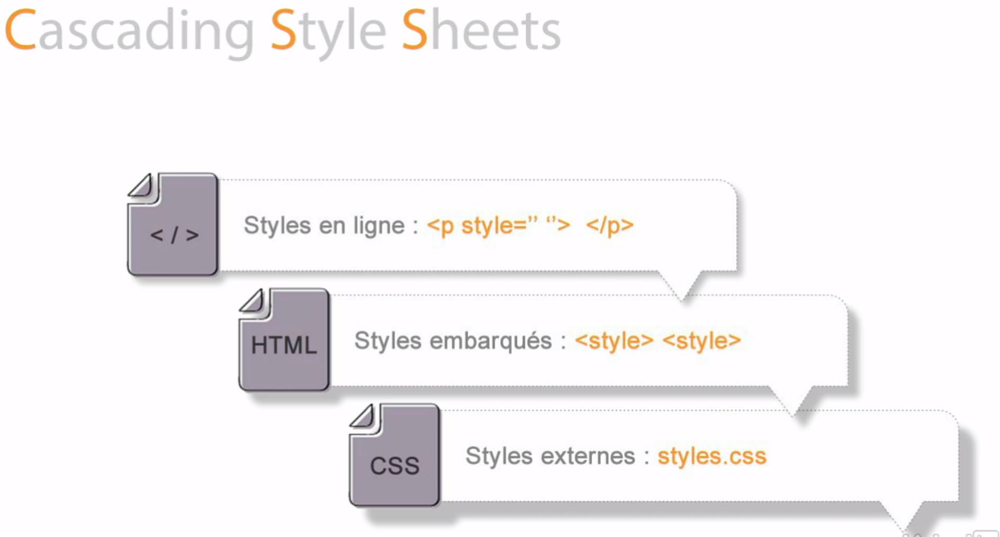

# Placement du code CSS

Pour placer son code CSS, il y 3 possibilités

## Dans les balises HTML

Cette méthode nommé **Inline Style** est à éviter dans la plupart des cas car elle risque de rendre votre code illisible et d'alourdir votre page HTML.

De plus, vous serez limité au état de base, vous ne pourrez pas interagir avec certains selecteurs tels que le hover, active, last-child, etc...

Exemple : 

[fichier HTML](avec-html.html)

## Dans la balise head

Cette méthode nommé **Internal Style Sheet** n'est pas non plus très recommendée car dans un gros projet, vous pouvez atteindre les centaines de lignes de code CSS donc en y ajoutant votre code HTML, vous allez devoir beaucoup scroller et perdre beaucoup de temps à vous y retouver. 

De plus, ce n'est pas modulable, imaginons que vous avez créer un projet avec plusieurs pages dont certaines parties du code CSS sont communes, cela vaut dire que vous allez devoir dupliquer votre code, ce qui est une perte de temps et ce qui peut être une source d'erreur... 

Une des première règle lorsqu'on utilise un language de programmation, c'est d'éviter la duplication de code, il y surement une autre solution.

Exemple : 

[fichier HTML](dans-balise-head.html)

## Dans un fichier CSS appart

Cette méthode nommée **External Style Sheet** est celle que je recommande.

Exemple : 

[fichier HTML](dans-fichier-css.html)

[fichier CSS](css/main.css)

---

[:back:](../css.md) | [:soon:](../chapitre-2/chapitre-2-regles-et-declarations.md)
