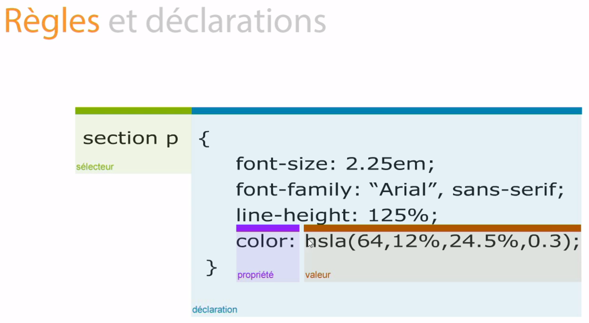

# Règles et déclarations

En CSS, il y a 4 éléments :

- Un sélecteur
- Une déclaration
- Une propriété
- Une valeur

Ci-dessous, le shémas représentant ces 4 élément :



## Exemple

Dans notre fichier HTML chapitre-2, nous constatons qu'il y a deux balise p

````html
   <section>
        <p>Lorem ipsum dolor sit amet, consectetur adipisicing elit. Fugiat laboriosam repudiandae sapiente. Alias blanditiis deleniti illum molestiae nobis possimus quae rem voluptatum! Aliquid esse, eveniet ipsum maiores modi quas unde?</p>
    </section>
    <p>Lorem ipsum dolor sit amet, consectetur adipisicing elit. Ad facilis numquam rem. Eaque excepturi nesciunt nihil quisquam veritatis voluptate! Delectus, impedit iste iusto porro praesentium quod repellat tempore ut voluptas?</p>
````

Une qui se trouve dans section et l'autre en dehors.

Dans mon fichier CSS, je modifie l'aspect visuel de celle qui se trouve dans section.

Je sélectionne d'abord l'élément HTML à modifier avec un sélecteur adéquat;

````css
header h1
````

Je commence ma déclaration à l'aide d'une accolade ouvrante

````css
{
````


Je modifie la coleur de fond de mon paragraphe avec une propriété 

````css
background-color:
````

J'utilise un code couleur qui sera la valeur de la propriété

````css
#014c8c;
````

Et pour finir, je ferme ma déclaration à l'aide d'une accolade fermante

````css
}
````


L'ensemble donne le code qui se situe dans le fichier [main.css](css/main.css)

````css
header h1{
    background-color: #014c8c;
}
````


