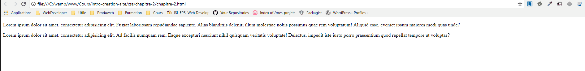
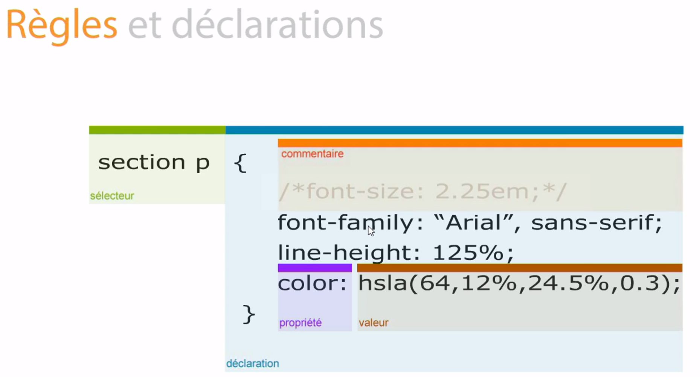

# Règles et déclarations

En CSS, il y a 4 principaux éléments :

- Un sélecteur
- Une déclaration
- Une propriété
- Une valeur

Ci-dessous, le shémas représentant ces 4 élément :


## Exemple

Dans notre fichier HTML [chapitre-2](chapitre-2.html), nous constatons qu'il y a deux balise p

````html
   <section>
        <p>Lorem ipsum dolor sit amet, consectetur adipisicing elit. Fugiat laboriosam repudiandae sapiente. Alias blanditiis deleniti illum molestiae nobis possimus quae rem voluptatum! Aliquid esse, eveniet ipsum maiores modi quas unde?</p>
    </section>
    <p>Lorem ipsum dolor sit amet, consectetur adipisicing elit. Ad facilis numquam rem. Eaque excepturi nesciunt nihil quisquam veritatis voluptate! Delectus, impedit iste iusto porro praesentium quod repellat tempore ut voluptas?</p>
````

Une qui se trouve dans section et l'autre en dehors.

Dans mon fichier CSS, je modifie l'aspect visuel de celle qui se trouve dans section.

**Etapes :**

Je sélectionne d'abord l'élément HTML à modifier avec un sélecteur adéquat;

````css
section p
````

Je commence ma déclaration à l'aide d'une accolade ouvrante

````css
{
````


Je modifie la coleur de fond de mon paragraphe avec une propriété 

````css
background-color:
````

J'utilise un code couleur qui sera la valeur de la propriété

````css
#014c8c;
````

Et pour finir, je ferme ma déclaration à l'aide d'une accolade fermante

````css
}
````


L'ensemble donne le code qui se situe dans le fichier [main.css](css/main.css)

````css
section p{
    background-color: #014c8c;
}
````

**Résultat :**





## Autre

Il est possible d'ajouter des commentaires à notre code CSS. 

Pour commencer un commentaire, il faut utiliser un slash puis une étoile comme ci-dessous

````css
/*
````

Pour finir un commentaire, il faut utiliser une étoile puis un slash comme ci-dessous

````css
*/
````

**_Tout ce qui se trouve dans un commentaire est ignoré par les navigateurs_**

Ci-dessous, le shémas représentant ces 4 élément + commentaire :




---

[:back:](../chapitre-1/chapitre-1-placement-du-code-css.md) | [:soon:](../chapitre-3/chapitre-3-style-defaut.md)