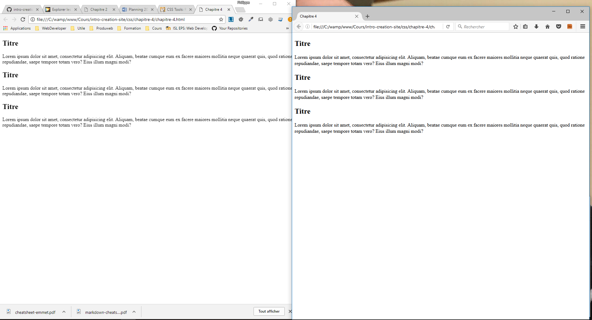
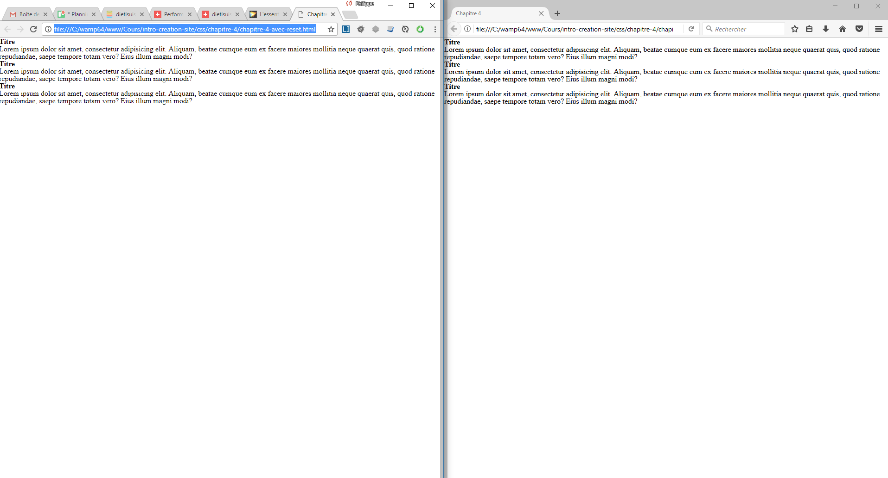

# Style par défaut

Lorsque vous allez coder en HTML &amp; CSS, vous devez tester le résultat sur tous les navigateurs (Chrome, Firefox, Safari, etc...).

Cependant, de base les navigateurs ont leur propre style CSS embarqué (style par défaut).

Comparons notre fichier [chapitre-3](chapitre-3.html) sur Chrome et Firefox :

Nous observons que le document ouvert dans Firefox ne termine pas au même niveau que dans Chrome et qu'il y a des différences d'espaces alors que nous n'avons pas ajouté du code CSS...

## Liste des différents navigateurs et de leur style par défaut

- Firefox

    Moteur : Gecko

    Documentation officielle : [Style par défaut](https://hg.mozilla.org/mozilla-central/file/tip/layout/style/res/html.css)

    Ou ouvrez Firefox et taper l'url suivante : [resource://gre-resources/html.css](resource://gre-resources/html.css)

- Chrome

    Moteur : Blink

    Documentation officielle : [Style par défaut](https://cs.chromium.org/chromium/src/third_party/WebKit/Source/core/css/html.css?utm_source=ponyfoo+weekly&utm_medium=email&utm_campaign=15)

- Chrome &amp; Safari &amp; Opera &amp; Android

    Moteur : WebKit

    Documentation officielle : [Style par défaut](http://trac.webkit.org/browser/trunk/Source/WebCore/css/html.css)

- Internet Explorer

    Documentation officielle : [Style par défaut](http://web.archive.org/web/20170122223926/http://www.iecss.com/)

---

Source : [Lien](https://stackoverflow.com/questions/6867254/browsers-default-css-for-html-elements)

---

## Solution & uniformiser

Plusieurs developpeurs ont créé leur propre fichier CSS qui permet d'annuler le style par défaut de tous les navigateurs.

Voici les plus connus :

- [Eric Meyer (initiateur du reset CSS)](https://meyerweb.com/eric/tools/css/reset/)
- [CSSReset](http://cssreset.com/)

Télécharger et placer un des reset.css dans votre projet, il faut le déclarer avant vos CSS comme sur l'exemple [ici](chapitre-3-avec-reset.html)

Comparons à maintenant notre fichier mais cette fois avec le reset.css sur Chrome et Firefox :

Nous observons que le document ouvert dans Firefox et Chrome sont identique !
