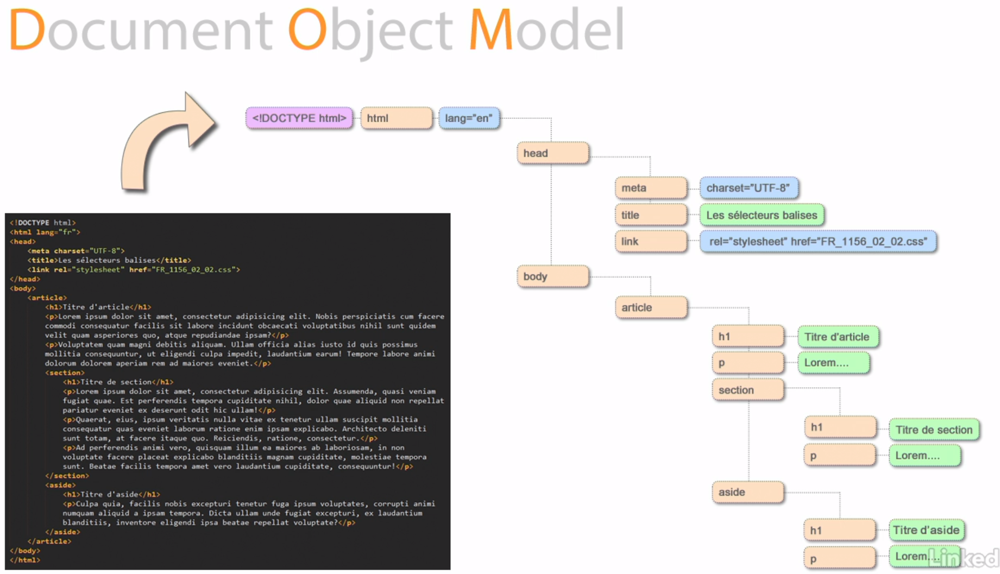
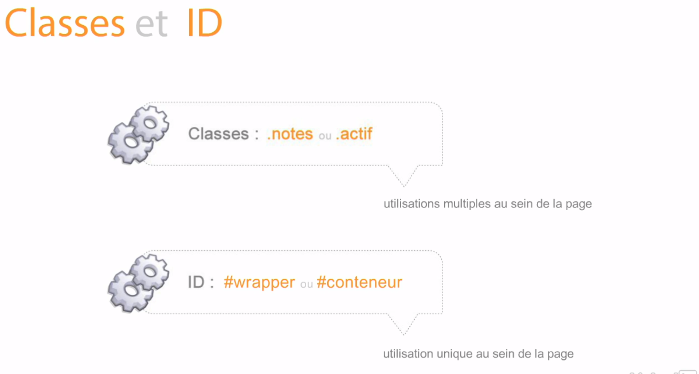

# Les sélecteurs

Pour bien comprendre les selecteurs, il faut bien comprendre ce qu'est le DOM.

Le DOM est le résultat de votre page HTML (ou XML) interprété par le navigateur sous forme d'arborescence d'objet.

Schémas d'exemple :



[Schémas en HTML](chapitre-4.html)

En résumé, les balises HTML sont des objets auxquels on peut ajouter des propriétés. Cela permet en autre de les manipuler via d'autres languages tel que Javascript ou CSS...


Il y a trois types de selecteurs :

- [Les selecteurs de balise](#les-selecteurs-de-balise)
- [Les selecteurs de classe](#les-selecteurs-de-classe)
- [Les selecteurs d'identifiant](#les-selecteurs-didentifiant)

## Les selecteurs de balise

En reprennant l'exemple du schéma, si je souhaite modifier le style des de toutes les balises ``<p>`` qui se trouve dans les balises ``<article>``, il faut écrire le code ci-dessous :

````css
article p{
    font-weight: bold;
}
````

En reprennant l'exemple du schéma, si je souhaite modifier le style des premières balises ``<p>`` qui se trouve au premier niveau dans les balises ``<article>``, il faut écrire le code ci-dessous :

````css
article>p{
    font-weight: bold;
}
````

En reprennant l'exemple du schéma, si je souhaite modifier le style des balises ``<p>`` qui se trouve dans les balises ``<section>``, il faut écrire le code ci-dessous :

````css
article section p{
    font-weight: bold;
}
````


## Les selecteurs de classe

L'utilisation des classes sont très pratiques et peuvent être utilisées sur plusieurs éléments HTML.

Imaginons que vous devez avoir le même style sur plusieurs éléments HTML qui sont différents et qui ne sont pas au même niveau.

Cela permet de modifier le style de certain élément en particulier, d'obtenir un code plus concis et de ne pas avoir de duplication de code CSS.

**Partie HTML**

```html
<h1 class="text-bold">Titre de section</h1>
```

**Partie CSS**

```css
.text-bold{
    font-weight: bold;
}
```


## Les selecteurs d'identifiant

L'utilisation des identifiants est fort similaire aux classes sauf qu'on ne peut que l'utiliser sur qu'une seule balise dans une page HTML (utilisation unique).

Par contre, les identifiant sont plus puissants que les classes, ce qui veut dire que les propriétés dans le style de l'identifiant annuleront le style des propriétés identiques dans une classe.
Exemple, si une classe modifie la couleur d'un élément mais qu'un identifiant aussi, ce sera la couleur de l'identifiant qui sera utilisée...

**Partie HTML**

```html
<h1 id="text-bold">Titre de section</h1>
```

**Partie CSS**

```css
#text-bold{
    font-weight: bold;
}
```

## Identifiant & classe





## Regroupement des séléecteurs


