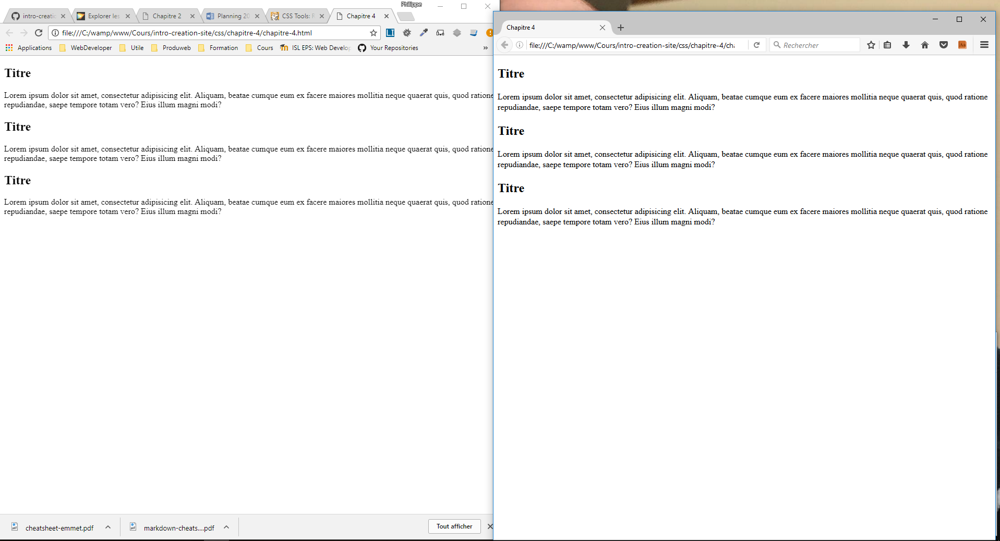

# Style par défaut

Lorsque vous allez coder HTML &amp; CSS, vous devez tester le résultat sur tous les navigateurs (Chrome, Firefox, Safari, etc...).

Cependant, de base les navigateurs ont leur propre style CSS embarqué (style par defaut).

Comparons notre fichier [chapitre-4](chapitre-4.html) sur Chrome et Firefox :

Nous observons que le document ouvert dans firefox ne termine pas au même niveau que dans Chrome et qu'il y a des différences d'espaces alors que nous n'avons pas ajouté du code CSS...

## Liste des différents navigateurs et de leur style par défaut

- Firefox

Documentation officielle : [Style par defaut](https://hg.mozilla.org/mozilla-central/file/tip/layout/style/res/html.css)

Ou ouvrez Firefox et taper l'url suivante : [resource://gre-resources/html.css](resource://gre-resources/html.css)

- Chrome

Documentation officielle : [Style par defaut](https://cs.chromium.org/chromium/src/third_party/WebKit/Source/core/css/html.css?utm_source=ponyfoo+weekly&utm_medium=email&utm_campaign=15)

- Moteur Webkit

Documentation officielle : [Style par defaut](http://trac.webkit.org/browser/trunk/Source/WebCore/css/html.css)

- Internet Explorer

Documentation officielle : [Style par default](http://web.archive.org/web/20170122223926/http://www.iecss.com/)