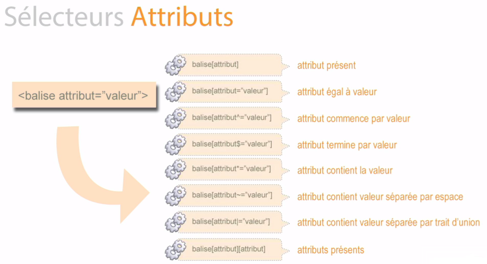
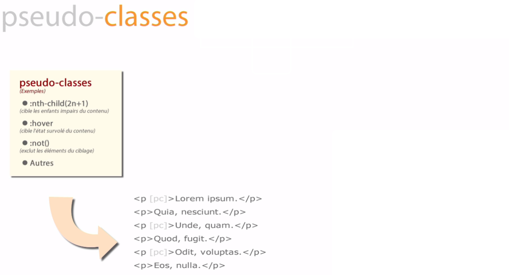
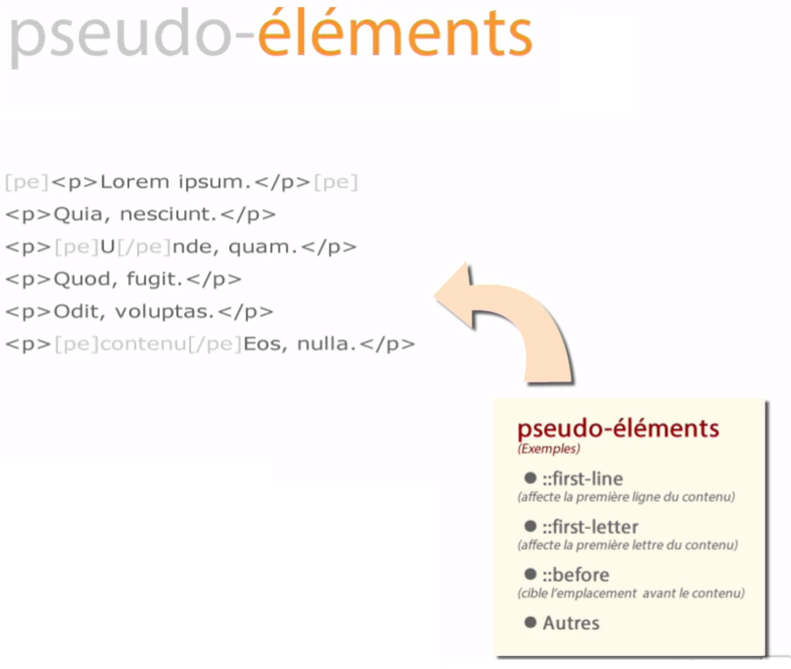

# Les sélecteurs avancés

## Sélecteurs Attributs



1. Attribut présent

    ````css
    p[class] {
    
    }
    ````

2. Attribut dont la valeur est égal

    ````css
    p[class="a"] {
    
    }
    ````
    
3. Attribut dont la valeur commence par

    ````css
    p[class^="a"] {
    
    }
    ````
    
4. Attribut dont la valeur termine par

    ````css
    p[class$="c"] {
    
    }
    ````
    
5. Attribut dont la valeur contient

    ````css
    p[class*="a"] {
    
    }
    ````
    
6. Attribut dont la valeur contient séparée par espace

    ````css
    p[class~="a"] {
    
    }
    ````
    
    ````html
    <p class="a b c"></p>
    ````
    
7. Attribut dont la valeur contient séparée par tiret

    ````css
    p[class|="a"] {
    
    }
    ````
    
    ````html
    <p class="a-b-c"></p>
    ````
    
8. Plusieurs attributs

    ````css
    p[class][id] {
    
    }
    ````


## Pseudo-classes




1. La première balise

    ````css
    p:first-child {
       background-color: #3c763d;
    }
    ````
    Exemple :
    
    ````html
    <body>     
        <p>Ici</p>
        <h1></h1>
        <p></p>
        <p></p>
    </body>
    ````
    
    **Attention**, si une balise ``<p>`` ne se trouve pas en première position (toutes balises confondues), le code CSS ne fonctionnera pas!
    
    Voici un exemple non fonctionnel car ``<h1>`` se trouve avant les ``<p>``, en première position...
    
    ````html
    <body>
        <h1></h1>
        <p></p>
        <p></p>
        <p></p>
    </body>
    ````
    
    Cette régle est valable pour ``:last-child`` et ``:nth-child``...
    
    Il y a d'autres sélecteurs qui pourront fonctionner avec n'import quelle structure.
    
    Il sagit de ``:first-of-type``, ``:nth-of-type()``, ``:last-of-type``
    
    

2. La première balise de type ``<p>``

    ````css
    p:first-of-type {
       background-color: #3c763d;
    }
    ````
    
    Exemple :
    
    ````html
    <body>
        <h1></h1>
        <h2></h2>
        <p>Ici</p>
        <p></p>
        <p></p>
    </body>
    ````
    
3. La dernière balise

    ````css
    p:last-child {
       background-color: #3c763d;
    }
    ````
    
    Exemple :
    
    ````html
    <body>   
        <p></p>
        <p></p>
        <p>Ici</p>
    </body>
    ````    
    
    **Attention**, si une balise ``<p>`` ne se trouve pas en derniere position (toutes balises confondues), le code CSS ne fonctionnera pas!
    
    Voici un exemple non fonctionnel car ``<h1>`` se trouve en dernier...
    
    :-1:
    
    ````html
    <body>
        <p></p>
        <p></p>
        <p></p>
        <h1></h1>
    </body>
    ````
    
    
4. La dernière balise de type ``<p>``

    ````css
    p:last-of-type {
       background-color: #3c763d;
    }
    ````
    
    Exemple :
    
    ````html
    <body>
        <p></p>
        <p></p>
        <p>Ici</p>
        <h1></h1>
    </body>
    ````
   
    
5. La quatrième balise

    ````css
    p:nth-child(4) { 
       background-color: #3c763d;
    }
    ````
    
    Exemple :
        
    ````html
    <body>   
        <p></p>
        <p></p>
        <p></p>
        <p>Ici</p>
        <p></p>
        <p></p>
    </body>
    ````    
    
    **Attention**, si une balise ``<p>`` ne se trouve pas en quatrième position (toutes balises confondues) , le code CSS ne fonctionnera pas!
    
    Voici un exemple non fonctionnel car ``<h1>`` se trouve avant les ``<p>``, en première position...
    
    :-1:
    
    ````html
    <body>
        <p></p>
        <p></p>
        <p></p>
        <h1></h1>
        <p></p>
        <p></p>
    </body>
    ````
    
5. La quatrième balise de type ``<p>``

    ````css
    p:nth-of-type(4) { 
       background-color: #3c763d;
    }
    ````
    
    Exemple :
        
    ````html
    <body>   
        <p></p>
        <p></p>
        <p></p>
        <h1></h1>
        <h2></h2>
        <p>Ici</p>
        <p></p>
        <p></p>
    </body>
    ````  
    
    
6. A partir de la troisième balise ``<p>`` selectionner toutes les deuxièmes balises ``<p>``

    ````css
    p:nth-child(2n+3) { 
       background-color: #3c763d;
    }
    ````
        
    Exemple :
        
    ````html
    <body>   
        <p></p>
        <p></p>
        <p>Ici</p>
        <p></p>
        <p>Ici</p>   
        <p></p>
        <p></p>
        <p>Ici</p>
        <p></p>
        <p>Ici</p>   
        <p></p>
        <p></p>
        <p>Ici</p>
        <p></p>
        <p>Ici</p>
    </body>
    ````  
    
7. Toutes les balises ``<p>`` jusqu'à la troisième

    ````css
    p:nth-child(-n+3) { 
       background-color: #3c763d;
    }
    ````
            
    Exemple :
        
    ````html
    <body>   
        <p>Ici</p>
        <p>Ici</p>
        <p>Ici</p>
        <p></p>
        <p></p>   
        <p></p>
        <p></p>
        <p></p>
        <p></p>
        <p></p>   
        <p></p>
        <p></p>
        <p></p>
    </body>
    ````
 
    
8. Toutes les balises ``<p>`` au survole du curseur

    ````css
    p:hover {
       background-color: #3c763d;
    }
    ````


## Pseudo-éléments




## Exercices

- [Execices partie 1](exercices)

    Télécharger le contenu du lien ci-dessus et liserle PDF
    Utiliser les mémos CSS pour vous aider
    
    
- [Execices partie 2](exercices-2)

    Télécharger le contenu du lien ci-dessus et vous trouverez l'énoncer dans le code HTML.
    Vous ne devez que manipuler le fichier main.css.
    Utiliser les mémos CSS pour vous aider


## Ressources

- [Liste des pseudo-classes](https://developer.mozilla.org/fr/docs/Web/CSS/Pseudo-classes)
- [CSS Cheat sheet](pdf/memento/CSS-Sheet.pdf)
- [Mémo CSS](pdf/memento/memo_css_proprietes.pdf)
- [memento CSS3](pdf/memento/memento-css3-v2.pdf)
- [Unicode](https://unicode-table.com/fr/#0063)
- [Unicode 2](https://apps.timwhitlock.info/emoji/tables/unicode)
- [Unicode Explication](https://www.w3schools.com/charsets/ref_utf_misc_symbols.asp)
- [Sélecteurs de niveau 3](https://www.w3.org/TR/css3-selectors/)
- [Sélecteurs de niveau 4](https://www.w3.org/TR/selectors4/)
- [Sélecteurs w3schools](https://www.w3schools.com/cssref/css_selectors.asp)


---

[:back:](../chapitre-4/chapitre-4-selecteurs.md) | [:soon:]()


