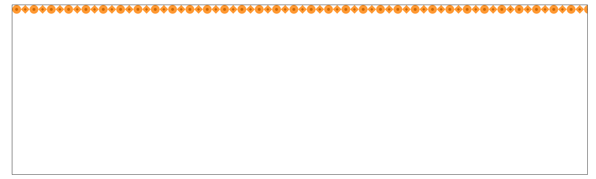
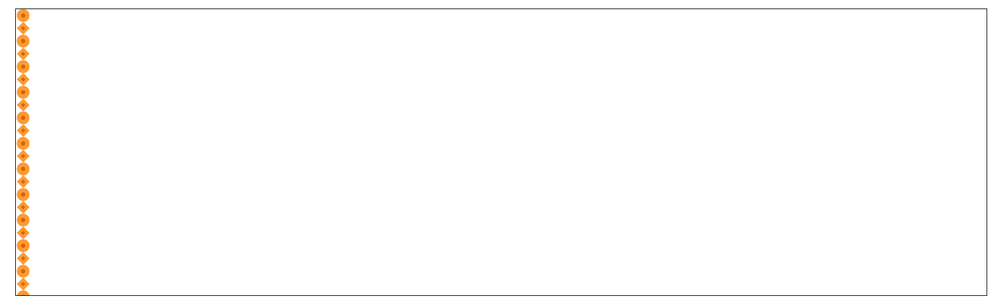
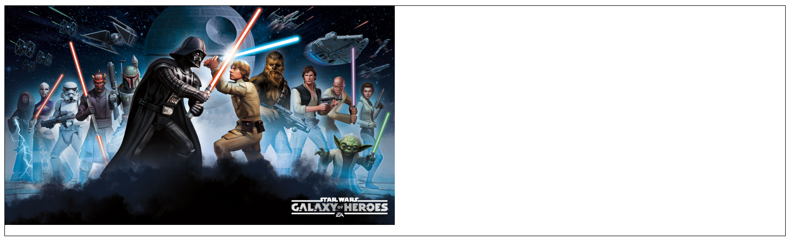
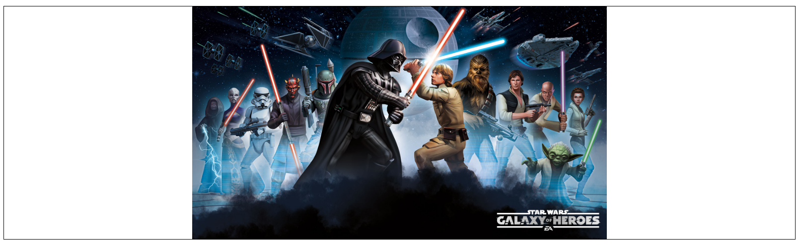

# background

## HTML de départ

````html
<section>
    <div></div>
    <div></div>
    <div></div>
    <div></div>
    <div></div>
    <div></div>
    <div></div>
    <div></div>
</section>
````

## Background color

Exemple simple d'un fond de couleur.

````css
section:first-of-type div:first-of-type {
  background-color: rgba(0,200,0,0.5);
}
````


## Background image repeat x

Exemple d'une image de fond qui se répète horizontalement

````css
section:first-of-type div:nth-of-type(3) {
  background-image: url(../img/border-h.png);
  background-repeat: repeat-x;
}
````



## Background image repeat y

Exemple d'une image de fond qui se répète verticalement

````css
section:first-of-type div:nth-of-type(3) {
  background-image: url(../img/border-h.png);
  background-repeat: repeat-y;
}
````



## Background image no repeat

Exemple d'une image de fond qui ne se répète pas, elle apparaît une fois

````css
section:first-of-type div:nth-of-type(3) {
  background-image: url(../img/border-h.png);
  background-repeat: no-repeat;
}
````



## Background image taille contain

Exemple d'une image de fond dont la taille est la plus proche du bord en gardant ses proportions

````css
  background-image: url(../img/starwars.jpg);
  background-size: contain;
  background-position: center center;
  background-repeat: no-repeat;
````



## Background image taille cover

Exemple d'une image de fond dont la taille remplis l'entièreté du conteneur. Parfait pour le responsive car l'image s'adapte.

````css
  background-image: url(../img/starwars.jpg);
  background-size: contain;
  background-position: center center;
  background-repeat: no-repeat;
````


## Background image clip

Exemple d'une image de fond dont la taille remplis l'entièreté du conteneur en rognant le padding.

````css
  background-image: url(../img/starwars.jpg);
  background-size: cover;
  background-clip: content-box;
  background-position: center center;
  background-repeat: no-repeat;
````


---

[:back:](chapitre-6.md)    
