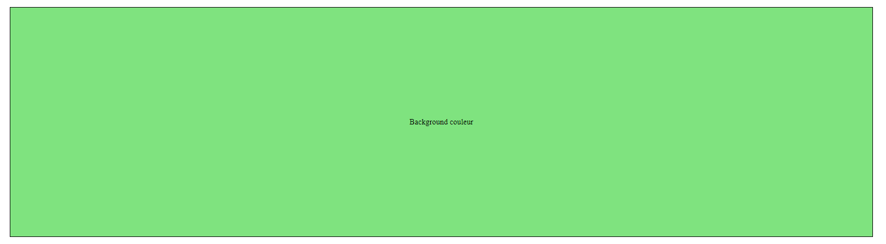

# background

## HTML de départ

````html
<section>
    <div></div>
    <div></div>
    <div></div>
    <div></div>
    <div></div>
    <div></div>
    <div></div>
    <div></div>
</section>
````

## Background color

````css
section:first-of-type div:first-of-type {
  background-color: rgba(0,200,0,0.5);
}
````




---

[:back:](chapitre-6.md)    
