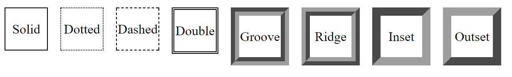

# Border

## Les différents styles

- Simple

````css
div{
  border-width: 1px;
  border-style: solid;
  border-color: #000;
}
````

- Avec des points

````css
div{
  border-width: 1px;
  border-style: dotted;
  border-color: #000;
}
````

- Avec des traits

````css
div{
  border-width: 1px;
  border-style: dashed;
  border-color: #000;
}
````

- Double

````css
div{
  border-width: 3px;
  border-style: double;
  border-color: #000;
}
````

- Effet 3D (rentrant)

````css
div{
  border-width: 10px;
  border-style: groove;
  border-color: #9e9e9e;
}
````

- Effet 3D (sortant)

````css
div{
  border-width: 10px;
  border-style: ridge;
  border-color: #9e9e9e;
}
````

- Effet 2D (rentrant)

````css
div{
  border-width: 10px;
  border-style: inset;
  border-color: #9e9e9e;
}
````

- Effet 2D (sortant)

````css
div{
  border-width: 10px;
  border-style: outset;
  border-color: #9e9e9e;
}
````




## L'utilisation d'une image


## Liens utiles

- [Informations complémentaires - styles](https://developer.mozilla.org/fr/docs/Web/CSS/border-style)
- [Informations complémentaires - images ](https://developer.mozilla.org/fr/docs/Web/CSS/border-image)
- [Tuto border image](https://letrainde13h37.fr/11/decouverte-de-la-propriete-css-border-image/)


---

[:back:](chapitre-6.md)    