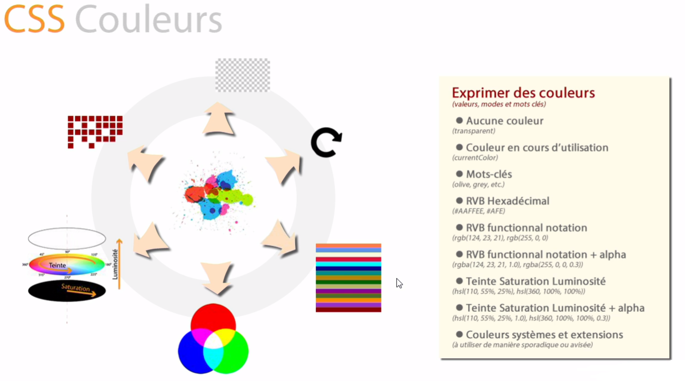

# Les propriétés

**Rappel de la déclaration :**


## Possibilités de toutes les propriétées


Avec les différentes propriétées, vous pouvez :

- Modifier la couleur des textes, la couleur de fond, ajouter une image de fond, etc...
- Modifier le texte dont la taille, la police, l'épaiseur, l'alignement, etc..
- Ajouter et modifier les bordures et outline (outline est une sorte de bordure externe)
- Modifier les espacement et le style de positionnement
- Obtenir une différence d'apparence entre desktop, mobile, impression, etc...
- Créer des animations
- Créer des formes [exemple ici](https://css-tricks.com/examples/ShapesOfCSS/)
- Créer des masques [exemple](https://css-tricks.com/clipping-masking-css/)


## Ecriture étendue ou abrégée

**Schémas avec margin (peut être utilisé de la même façon avec padding) :**


**Autres versions courtes**


**Attention avec la version abrégée pour la propriété ``font``, vous devez respecter l'ordre**


# Les valeurs

Vous trouverez l'évolution et les descriptions des différentes valeurs sur [W3C](https://www.w3.org/TR/css-values-3/)


## Les types de valeurs

**Schémas des différents types de valeurs :**


### Type nombre


```css
p {
  font-size: 10px;
}
```

`` 10 px `` est un nombre de type fixe.


```css
body {
    font-size: 10px;
}

p {
    font-size: 12px;
}

p:nth-of-type(4) {
   font-size: 0.5em;
}
```

`` 0.5em `` est un nombre de type proportionnelle.

Cela vaut dire que la taille de la police de ```p:nth-of-type(4)``` sera la moitié de sont parent direct donc ``p``


```css
body {
    font-size: 10px;
}

p {
    font-size: 12px;
}

p:nth-of-type(4) {
   font-size: 0.5rem;
}
```

`` 0.5rem `` est un nombre de type proportionnelle.

Cela vaut dire que la taille de la police de ```p:nth-of-type(4)``` sera la moitié de sont du premier parent donc ``body``


```css
div{
    width: 50%;
}
```

`` 50% `` est un nombre de type proportionnelle par rapport à la largeur.


```css
h1 {
  font-size: 1vw;
}
```

`` 1vw `` est un nombre de type proportionnelle par rapport à la largeur.

Cela veut dire 1% de la largeur de votre écran.


```css
h1 {
  font-size: 1vh;
}
```

`` 1vh `` est un nombre de type proportionnelle par rapport à la hauteur.

Cela veut dire 1% de la hauteur de votre écran.


```css
h1 {
  font-size: 1vmin;
}
```

`` 1vmin `` est un nombre de type proportionnelle par rapport à la largeur et hauteur.

C'est très intéressant pour le responsive...


### Type texte

```css
p {
  font-family: "Times New Roman", Times, serif;
}
```

Vous trouverez la liste des noms de polices de bases disponibles [ICI](https://www.w3schools.com/cssref/css_websafe_fonts.asp) ou [ICI](https://www.w3.org/Style/Examples/007/fonts.fr.html)

```css
p:before {
  content: "\2618";
}
```

Ici vous utilisez un texte qui représente une icon ou un caractère spécial comme [ici](https://unicode-table.com/fr/#0063)
        
### Type mots-clés

```css
p {
  font-size: x-large;
}
```

Vous constatez que ``x-large`` n'est pas numérique.

```css
body {
  color: #3c763d;
}

p {
  color: inherit;
}
```

``inherit`` veut dire que la valeur sera la même que celle du sélecteur parent. 
Si aucun sélecteur parent ne se trouve dans le code CSS, il reprendra la valeur de body...

```css
body {
  color: #3c763d;
}

p {
  color: #000000!important;
}
```

``!important`` veut dire que la valeur sera la plus importante de tout le code CSS donc ce sera la seule prise en compte.
Ce mot-clé est à utiliser qu'en cas d'**extrème nécessité** !


### Type couleur




```css
p {
  color: #000;
}
```

```css
p {
  color: rgba(0,0,0,0.5);
}
```

L'avantage avec ``rgba``, c'est que l'on peut gèrer l'opacité.


### Type expressions


- **Calcul**

    ```css
    div {
      margin-left: calc(100%*4);
    }
      
    div {
      width: calc(200px + (100%*4));
    }
    ```
    
    Vous pouvez effectuer un bon nombre de calcul intéressant.
    
    
    
- **Attribut**
   
    ```css
    div:after {
      content: attr(data-ref);
    }
    ```
    
    ```html
    <p data-ref="1234"></p>
    ```
    
    ``attr(data-ref)`` va rechercher la valeur de l'attribut HTML ``data-ref`` donc 1234
    
    
    
- **Counteur**
    
    ```css
    body {
      counter-reset: titre;
    }
    h1{
      counter-increment: titre;
    }
    h1:before{
      content: counter(titre) " - ";
    }
    ```
    
    
    
    
    
    


---

[:back:](../chapitre-5/chapitre-5.md) | [:soon:]()    
    
    