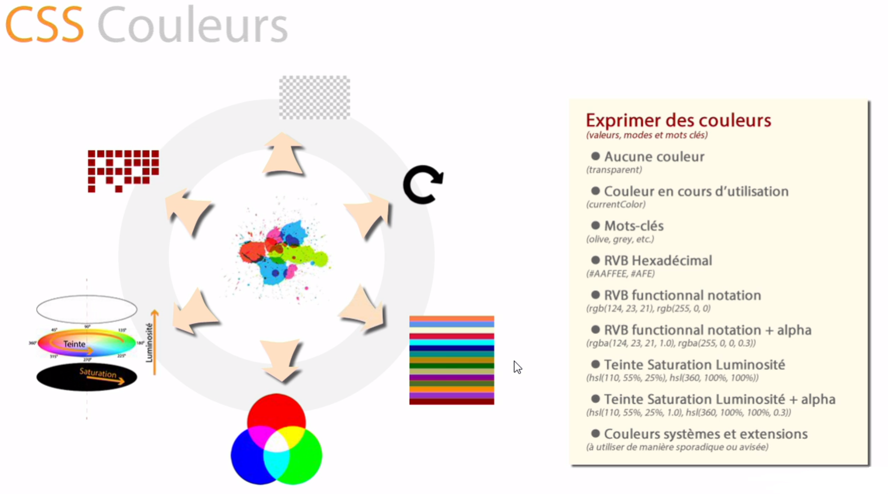
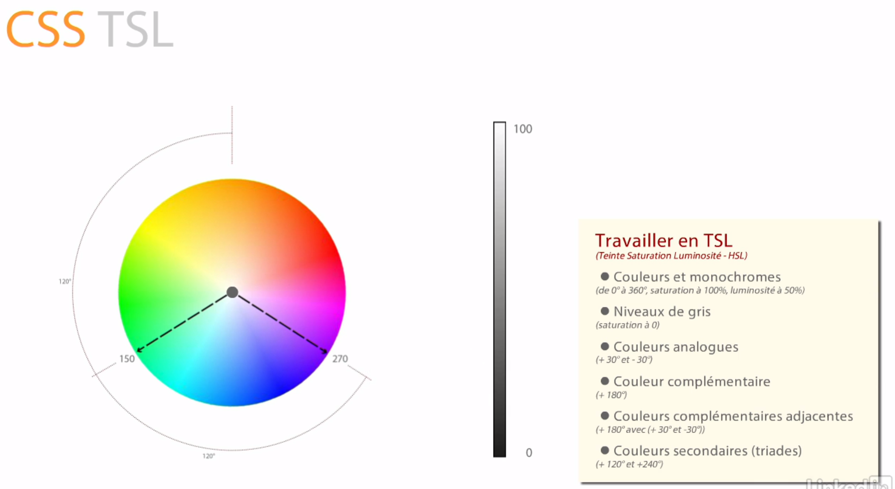

# Type couleur




**Couleur en version mots-clés**

```css
p {
  color: green;
}
```

```css
p {
  color: blue;
}
```


**Couleur en version hexadecimal**

```css
p {
  color: #000;
}
```


**Couleur en version decimal**

```css
p {
  color: rgb(0,0,0);
}
```

``rgb`` est l'abrégé de red green blue

Elle permet de réglé la valeur de rouge de 0 à 255, le vert de 0 à 255 et le bleu de 0 à 255.


```css
p {
  color: rgba(0,0,0,0.5);
}
```


Avec ``rgba``, on peut gèrer également l'opacité de 0 à 1.


```css
p {
  color: hsl(60,100%,25%);
}
```




```css
p {
  color: hsla(60,100%,25%,0.5);
}
```

Avec ``hsla``, on peut gèrer l'opacité.


### Liens utiles

- [Liste des coleurs](https://www.w3.org/wiki/CSS/Properties/color/keywords)
- [Liste des coleurs et des fonctions](https://developer.mozilla.org/en-US/docs/Web/CSS/color_value)
- [Adobe color CC](https://color.adobe.com/fr/create/color-wheel/?base=2&rule=Analogous&selected=0&name=Mon%20th%C3%A8me%20Color&mode=rgb&rgbvalues=0.709087013219719,1,0.650510065756196,0.91,0.6595764867472764,0.04550000000000004,1,0,0,0.14143670494515384,0.04550000000000004,0.91,0.050000000000000044,1,0.7169197085622045&swatchOrder=0,1,2,3,4)
- [Paletton](http://paletton.com/#uid=1000u0kllllaFw0g0qFqFg0w0aF)