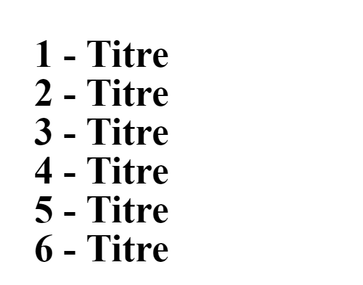

# Type expressions


- **Calcul**

    ```css
    div {
      margin-left: calc(100%*4);
    }
      
    div {
      width: calc(200px + (100%*4));
    }
    ```
    
    Vous pouvez effectuer un bon nombre de calcul intéressant.
    
    
    
- **Attribut**
   
    ```css
    div:after {
      content: attr(data-ref);
    }
    ```
    
    ```html
    <p data-ref="1234"></p>
    ```
    
    ``attr(data-ref)`` va rechercher la valeur de l'attribut HTML ``data-ref`` donc 1234
    
    
    
- **Counteur**
    
    ```css
    body {
      counter-reset: titre;
    }
    h1{
      counter-increment: titre;
    }
    h1:before{
      content: counter(titre) " - ";
    }
    ```
    
    
    
    
    