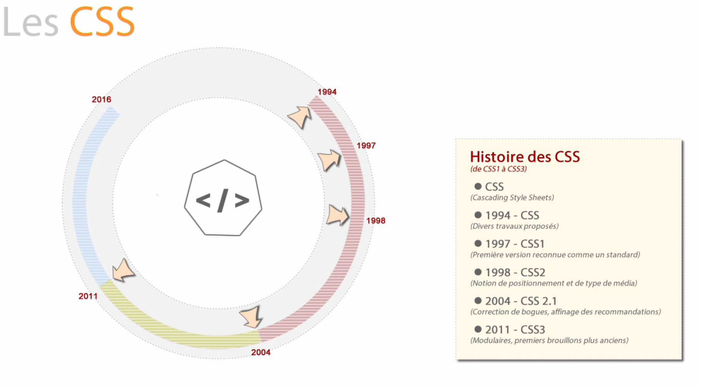
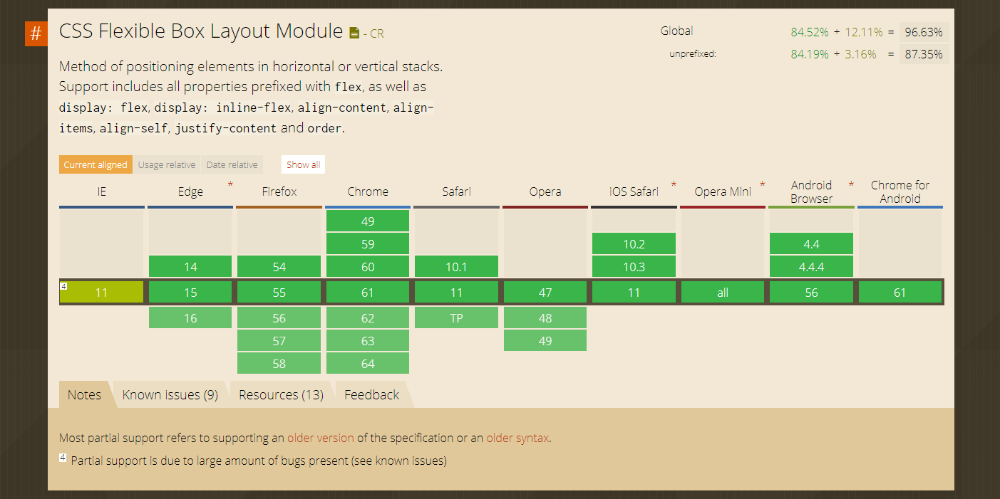

# CSS

Le language CSS permet de gérer le visuel des contenus situés dans le document HTML.
Grâce à lui, nous pouvons modifier la taille de la police, la couleur, ajouter une couleur de fond, etc...

Il y a eu plusieurs versions du CSS et actuellement, nous sommes à la version 3. 

Dans la nouvelle version, certaines propriétés ou valeurs ne sont pas compatibles avec toutes les versions des navigateurs. 

Si vous désirez savoir quelle propriété ou valeur est compatible ou non, vous pouvez aller sur le site [Can I use ?](http://www.caniuse.com/), vous y trouverez toutes les compatibilités avec les différentes versions de Chrome, Firefox, Safari, Edge, etc...

Voici un exemple de tableau des compatibilités pour les Flexbox :

## Table des matières

- [Chapitre 1 - Placement du code CSS](chapitre-1/chapitre-1-placement-du-code-css.md)
- [Chapitre 2 - Règles et déclarations](chapitre-2/chapitre-2-regles-et-declarations.md)
- [Chapitre 3 - Style par défaut](chapitre-3/chapitre-3-style-defaut.md)
- [Chapitre 4 - Les sélecteurs](chapitre-4/chapitre-4-selecteurs.md)
- [Chapitre 5 - Les sélecteurs avancés](chapitre-5/chapitre-5.md)
- [Chapitre 6 - Les propriétés & leurs valeurs](chapitre-6/chapitre-6.md)
- [Chapitre 7 - Le flux courant](chapitre-7/chapitre-7.md)
- [Chapitre 8 - Les positionnements](chapitre-8/chapitre-8.md)

---

[:back:](../autres/lorem-ipsum.md) | [:soon:](../compilateur/compilateur.md)
