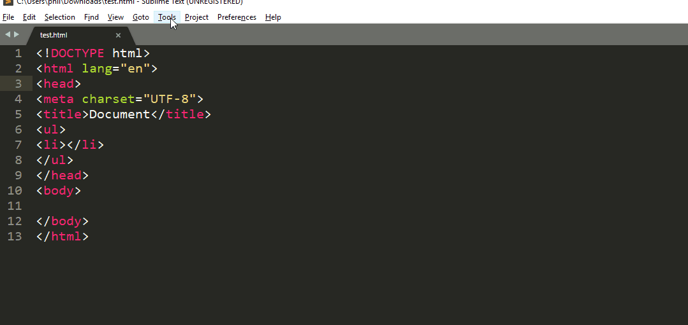
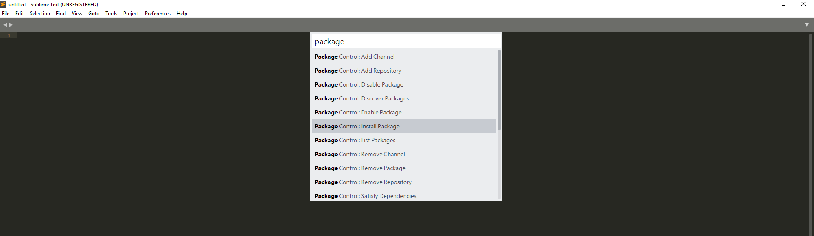
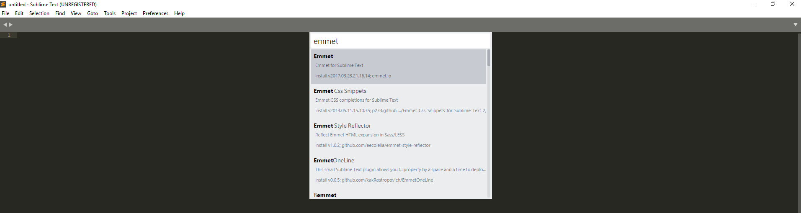
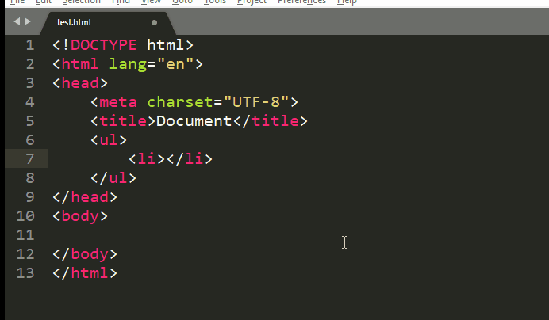
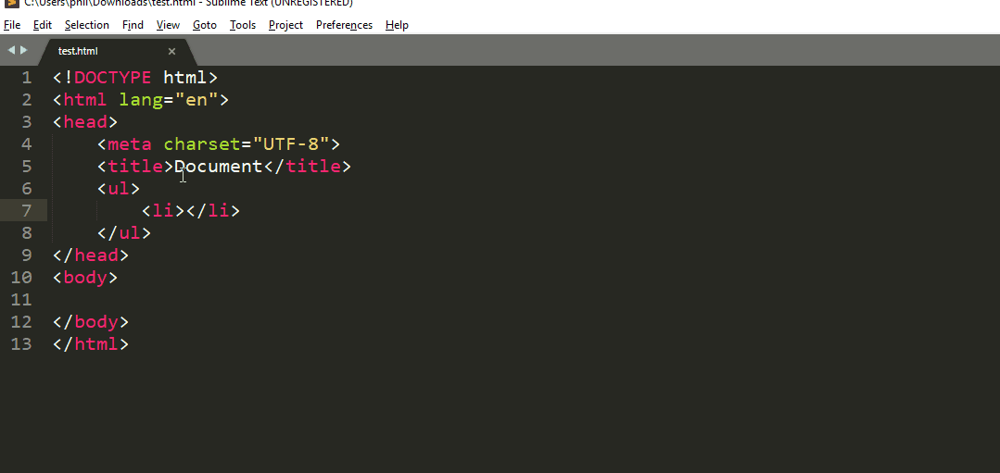

# Sublime Text

## Installation

Vous pouvez aller sur ce [lien](https://www.sublimetext.com) afin de télécharger Sublime text.

Il est possible de l'obtenir en version portable!

## Raccourcis

Lorsque vous travaillez avec un éditeur de texte, il est préférable de connaitre les racourcis clavier.

Chaque éditeur a ses propre racourcis!

Voici les raccourcis Windows sur ce [lien](sublime-text/pdf/racourcis-windows.pdf)

Voici les raccourcis MacOS sur ce [lien](sublime-text/pdf/racourcis-osx.pdf)

Au début, essayez d'avoir votre feuille de racourcis près de vous lorsque vous coder.

**Vous allez surement chercher après le racourcis qui va indenter votre code... De base, il n'en existe pas!** 



## Packages

Les packages sont des modules qui permettent d'ajouter de nouvelles fonctionnalités à Sublime Text. Par exemple, si vous coder en HTML, il y a des modules qui permettent de vérifier la syntaxe de votre code et de vous alerter.

Afin d'installer les packages plus facilement, vous devez installer le "Package Control" en allant dans "Tools" puis cliquer sur Install Package Control...

Pour vérifier si Package Control fonctionne, cliquer sur ctrl+p et dans le champ texte, taper package.



Pour installer un package, cliquer sur ctrl+p taper install et cliquer sur Install Package. Une deuxième popup va apparaître, dans celle-ci taper le nom du module souhaité et cliquer dessus.



Pour rechercher un package ou trouver la documentation d'un package en particulier, vous pouvez aller aussi sur [https://packagecontrol.io/](https://packagecontrol.io/)


### Packages incontournables


#### Emmet

Ce package permet de coder beaucoup plus rapidement à l'aide de snippets, d'abréviation de code, de raccourcis et bien plus encore.

Lien : [https://packagecontrol.io/packages/Emmet](https://packagecontrol.io/packages/Emmet)

**Exemple d'abréviation :**

En tapant le code ```ul>li*4>a``` puis sur <kbd>tab</kbd>, vous obtenez le code ci-dessous

```html
<ul>
  <li><a href=""></a></li>
  <li><a href=""></a></li>
  <li><a href=""></a></li>
  <li><a href=""></a></li>
</ul>
```

En tapant le code ```html:5``` puis sur <kbd>tab</kbd>, vous obtenez le code ci-dessous

```html
<!DOCTYPE html>
<html lang="en">
<head>
  <meta charset="UTF-8">
  <title>Document</title>
</head>
<body>
  
</body>
</html>
```

**Raccourcis  intéressants :**

1. Monter ou déscendre une ligne entière de votre code

<kbd>Ctrl</kbd> + <kbd>Shift</kbd> + &uparrow;

<kbd>Ctrl</kbd> + <kbd>Shift</kbd> + &downarrow;



2. Selection progressive

<kbd>Shift</kbd> + &uparrow;

<kbd>Shift</kbd> + &downarrow;

<kbd>Shift</kbd> + &leftarrow;

<kbd>Shift</kbd> + &rightarrow;




#### GotoDocumentation


#### GotoDocumentation

Plus besoin de chercher comment ecrire tels ou tels code sur internet... Grâce à ce module, vous pouvez trouver votre documentation plus facilement.

Lien : [https://packagecontrol.io/packages/GotoDocumentation](https://packagecontrol.io/packages/GotoDocumentation)

Utilisation : <kbd>![Windows Key][newwinlogo]</kbd> + <kbd>Shift</kbd> + h

## Liens utiles

- [Documentation](http://docs.sublimetext.info/en/latest/reference/keyboard_shortcuts_win.html)

- [https://stackoverflow.com/questions/9495007/indenting-code-in-sublime-text-2](https://stackoverflow.com/questions/9495007/indenting-code-in-sublime-text-2)