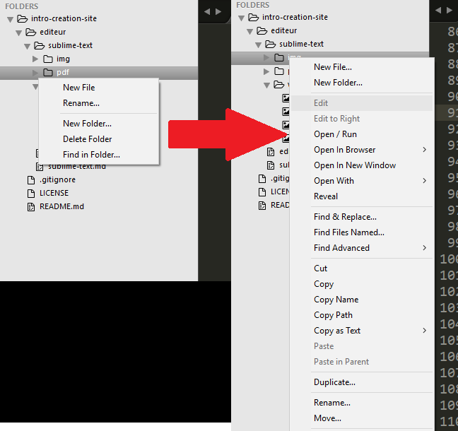
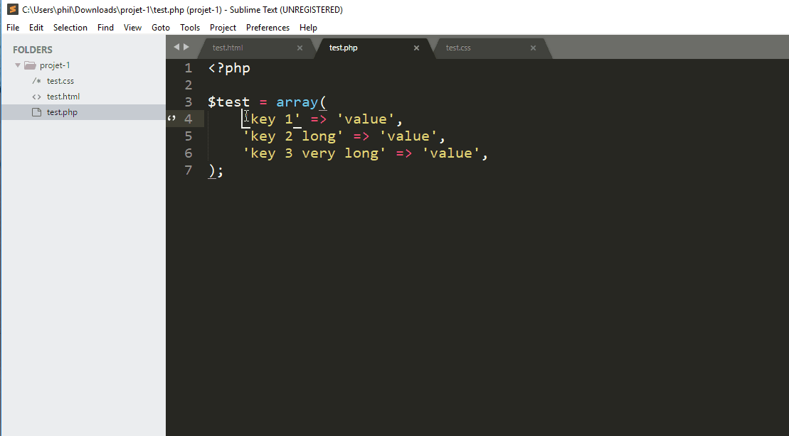
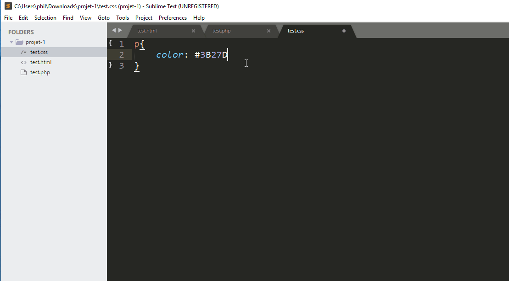
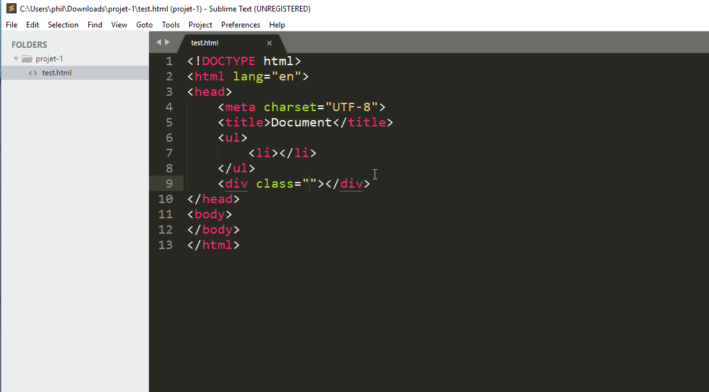

# Sublime Text

## Installation

Vous pouvez aller sur ce [lien](https://www.sublimetext.com) afin de télécharger Sublime text.

Il est possible de l'obtenir en version portable!

## Raccourcis

Lorsque vous travaillez avec un éditeur de texte, il est préférable de connaitre les racourcis clavier.

Chaque éditeur a ses propres racourcis!

Voici les raccourcis Windows sur ce [lien](sublime-text/pdf/racourcis-windows.pdf)

Voici les raccourcis MacOS sur ce [lien](sublime-text/pdf/racourcis-osx.pdf)

Au début, essayez d'avoir votre feuille de racourcis près de vous lorsque vous coder.

**Vous allez surement chercher après le racourcis qui va indenter votre code... De base, il n'en existe pas!** 


## Packages

Les packages sont des modules qui permettent d'ajouter de nouvelles fonctionnalités à Sublime Text. Par exemple, si vous coder en HTML, il y a des modules qui permettent de vérifier la syntaxe de votre code et de vous alerter.

Afin d'installer les packages plus facilement, vous devez installer le "Package Control" en allant dans "Tools" puis cliquer sur Install Package Control...

Pour vérifier si Package Control fonctionne, cliquer sur <kbd>Ctrl</kbd> + <kbd>p</kbd> et dans le champ texte, taper package.


Pour installer un package, cliquer sur ctrl+p taper install et cliquer sur Install Package. Une deuxième popup va apparaître, dans celle-ci taper le nom du module souhaité et cliquer dessus.


Pour rechercher un package ou trouver la documentation d'un package en particulier, vous pouvez aller aussi sur [https://packagecontrol.io/](https://packagecontrol.io/)


### Packages incontournables


#### Emmet

Ce package permet de coder beaucoup plus rapidement à l'aide de snippets, d'abréviation de code, de raccourcis et bien plus encore.

Lien : [https://packagecontrol.io/packages/Emmet](https://packagecontrol.io/packages/Emmet)

**Exemple d'abréviation :**

En tapant le code ```ul>li*4>a``` puis sur <kbd>tab</kbd>, vous obtenez le code ci-dessous

```html
<ul>
  <li><a href=""></a></li>
  <li><a href=""></a></li>
  <li><a href=""></a></li>
  <li><a href=""></a></li>
</ul>
```

En tapant le code ```html:5``` puis sur <kbd>tab</kbd>, vous obtenez le code ci-dessous

```html
<!DOCTYPE html>
<html lang="en">
<head>
  <meta charset="UTF-8">
  <title>Document</title>
</head>
<body>
  
</body>
</html>
```

**Raccourcis  intéressants :**

1. Monter ou descendre une ligne entière de votre code

<kbd>Ctrl</kbd> + <kbd>Shift</kbd> + &uparrow;

<kbd>Ctrl</kbd> + <kbd>Shift</kbd> + &downarrow;


2. Selection progressive

<kbd>Shift</kbd> + &uparrow;

<kbd>Shift</kbd> + &downarrow;

<kbd>Shift</kbd> + &leftarrow;

<kbd>Shift</kbd> + &rightarrow;


#### Side​Bar​Enhancements

Ce module permet d'obtenir des options supplémentaires lorqu'on clique la sidebar du projet

Lien : [https://packagecontrol.io/packages/SideBarEnhancements](https://packagecontrol.io/packages/SideBarEnhancements)

**Sans et avec le module**




#### Doc​Blockr

Ce module permet de commenter vos fonction PHP, Javascript, etc...

Lien : [https://packagecontrol.io/packages/DocBlockr](https://packagecontrol.io/packages/DocBlockr)


#### Alignment

Ce module permet d'aligner un tableau PHP, Javascript

Lien : [https://packagecontrol.io/packages/Alignment](https://packagecontrol.io/packages/Alignment)

Configuration :

- Aller dans Preferences > Package Settings > Alignment > Settings - User
- Ajouter le code ci-dessous :

````
{
    // The mid-line characters to align in a multi-line selection, changing
    // this to an empty array will disable mid-line alignment
    "alignment_chars": [
        "=", ":"
    ]
}
````

Utilisation : <kbd>Ctrl</kbd> + <kbd>Alt</kbd> + <kbd>a</kbd>




#### GotoDocumentation

Plus besoin de chercher comment ecrire tels ou tels code sur internet... Grâce à ce module, vous pouvez trouver votre documentation plus facilement.

Lien : [https://packagecontrol.io/packages/GotoDocumentation](https://packagecontrol.io/packages/GotoDocumentation)

Utilisation : <kbd>Windows</kbd> + <kbd>Shift</kbd> + h


#### Color Highlighter

Ce module permet de visualiser la couleur correspondant à un code couleur

Lien : [https://packagecontrol.io/packages/Color%20Highlighter](https://packagecontrol.io/packages/Color%20Highlighter)





#### ColorPicker

Ce module permet d'utiliser un color picker pour vos fichier CSS

Lien : [https://packagecontrol.io/packages/ColorPicker](https://packagecontrol.io/packages/ColorPicker)

Utilisation : <kbd>ctrl</kbd> + <kbd>Shift</kbd> + c


#### Case Conversion

Ce module permet de modifier le formatage d'un texte

Lien : [hhttps://packagecontrol.io/packages/Case%20Conversion](https://packagecontrol.io/packages/Case%20Conversion)

**Raccourcis :**

Certains raccourcis vont par 2 !

- Séparer plusieurs textes par un espace

<kbd>Ctrl</kbd> + <kbd>Alt</kbd> + <kbd>c</kbd>
<kbd>Ctrl</kbd> + <kbd>Alt</kbd> + <kbd>w</kbd>

- Convertir le texte en minuscule

<kbd>Ctrl</kbd> + <kbd>k</kbd>
<kbd>Ctrl</kbd> + <kbd>L</kbd>

- Convertir le texte en Majuscule

<kbd>Ctrl</kbd> + <kbd>k</kbd>
<kbd>Ctrl</kbd> + <kbd>u</kbd>

- Séparer chaques textes par une majuscule (PascalCase)

<kbd>Ctrl</kbd> + <kbd>Alt</kbd> + <kbd>c</kbd>
<kbd>Ctrl</kbd> + <kbd>Alt</kbd> + <kbd>p</kbd>

- Chaques textes à une majuscule sauf le premier (camelCase)

<kbd>Ctrl</kbd> + <kbd>Alt</kbd> + <kbd>c</kbd>
<kbd>Ctrl</kbd> + <kbd>Alt</kbd> + <kbd>c</kbd>

- Séparer chaques textes par un underscore (snake_case)

<kbd>Ctrl</kbd> + <kbd>Alt</kbd> + <kbd>c</kbd>
<kbd>Ctrl</kbd> + <kbd>Alt</kbd> + <kbd>s</kbd>

- Séparer chaques textes par un tiret (dash-case)

<kbd>Ctrl</kbd> + <kbd>Alt</kbd> + <kbd>c</kbd>
<kbd>Ctrl</kbd> + <kbd>Alt</kbd> + <kbd>h</kbd>

- Séparer chaques textes par un point (dot.case)

<kbd>Ctrl</kbd> + <kbd>Alt</kbd> + <kbd>c</kbd>
<kbd>Ctrl</kbd> + <kbd>Alt</kbd> + <kbd>d</kbd>

- Passer d'un formatage à l'autre entre snake_case à PascalCase et camelCase

<kbd>Ctrl</kbd> + <kbd>Shift</kbd> + <kbd>-</kbd>


#### Bracket​Highlighter

Ce module permet de vous indiquer où se situe le tag de fermeture, la fin d'une fonction, etc...

Lien : [https://packagecontrol.io/packages/BracketHighlighter](https://packagecontrol.io/packages/BracketHighlighter)


#### GotoDocumentation

Plus besoin de chercher comment ecrire tels ou tels code sur internet... Grâce à ce module, vous pouvez trouver votre documentation plus facilement.

Lien : [https://packagecontrol.io/packages/GotoDocumentation](https://packagecontrol.io/packages/GotoDocumentation)

Utilisation : <kbd>Windows</kbd> + <kbd>Shift</kbd> + h


#### Bootstrap 4 Autocomplete

Ce module permet d'automatiquement completer vos attributs class avec les class existantes de Bootstrap 4

Lien : [https://packagecontrol.io/packages/Bootstrap%204%20Autocomplete](https://packagecontrol.io/packages/Bootstrap%204%20Autocomplete)




#### Bootstrap 4 Snippets

Ce module permet d'obtenir de nombreux snippets Bootstrap 4

Lien : [https://packagecontrol.io/packages/Bootstrap%204%20Snippets](https://packagecontrol.io/packages/Bootstrap%204%20Snippets)

**Exemple de snippets :**

En tapant le code ```cards``` puis sur <kbd>tab</kbd>, vous obtenez le code ci-dessous

````html
    <div class="card">
      
      <div class="card-block">
        <h4 class="card-title">Card title</h4>
        <p class="card-text">Some quick example text to build on the card title and make up the bulk of the card's content.</p>
        <a href="#" class="btn btn-primary">Button</a>
      </div>
    </div>
````

En tapant le code ```jumbotron``` puis sur <kbd>tab</kbd>, vous obtenez le code ci-dessous

````html
    <div class="jumbotron">
      <h1 class="display-3">Hello, world!</h1>
      <p class="lead">This is a simple hero unit, a simple jumbotron-style component for calling extra attention to featured content or information.</p>
      <hr class="m-y-md">
      <p>It uses utility classes for typography and spacing to space content out within the larger container.</p>
      <p class="lead">
        <a class="btn btn-primary btn-lg" href="#" role="button">Learn more</a>
      </p>
    </div>
````


## Liens utiles

- [Documentation](http://docs.sublimetext.info/en/latest/reference/keyboard_shortcuts_win.html)

- [https://stackoverflow.com/questions/9495007/indenting-code-in-sublime-text-2](https://stackoverflow.com/questions/9495007/indenting-code-in-sublime-text-2)