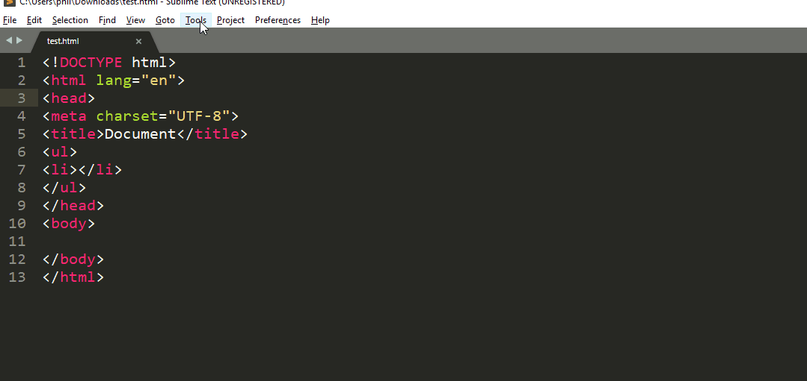

# Sublime Text

## Installation

Vous pouvez aller sur ce [lien](https://www.sublimetext.com) afin de télécharger Sublime text.

Il est possible de l'obtenir en version portable!

## Raccourcis

Lorsque vous travaillez avec un éditeur de texte, il est préférable de connaitre les racourcis clavier.

Chaque éditeur a ses propres racourcis!

Voici les raccourcis Windows sur ce [lien](pdf/racourcis-windows.pdf)

Voici les raccourcis MacOS sur ce [lien](pdf/racourcis-osx.pdf)

Au début, essayez d'avoir votre feuille de racourcis près de vous lorsque vous codez.

**Vous allez sûrement chercher après le racourcis qui va indenter votre code... De base, il n'en existe pas!** 

## Packages

Les packages sont des modules qui permettent d'ajouter de nouvelles fonctionnalités à Sublime Text. Par exemple, si vous coder en HTML, il y a des modules qui permettent de vérifier la syntaxe de votre code et de vous alerter.

Afin d'installer les packages plus facilement, vous devez installer le "Package Control" en allant dans "Tools" puis cliquer sur Install Package Control...

Pour vérifier si Package Control fonctionne, cliquez sur <kbd>Ctrl</kbd> + <kbd>p</kbd> et dans le champ texte, tapez package.

Pour installer un package, cliquez sur ctrl+p taper install et cliquez sur Install Package. Une deuxième popup va apparaître, dans celle-ci tapez le nom du module souhaité et cliquez dessus.

Pour rechercher un package ou trouver la documentation d'un package en particulier, vous pouvez aller aussi sur [https://packagecontrol.io/](https://packagecontrol.io/)

Ci-dessous, vous trouverez le liens vers les packages de base à utiliser

[Packages incontournables](packages.md)

## Liens utiles

- [Documentation](http://docs.sublimetext.info/en/latest/reference/keyboard_shortcuts_win.html)

- [https://stackoverflow.com/questions/9495007/indenting-code-in-sublime-text-2](https://stackoverflow.com/questions/9495007/indenting-code-in-sublime-text-2)

- [Documentation Linter](http://borntocode.fr/sublime-text-2-configurer-sublimelinter-pour-afficher-ses-erreurs/)

---

[:back:](../editeur.md)
