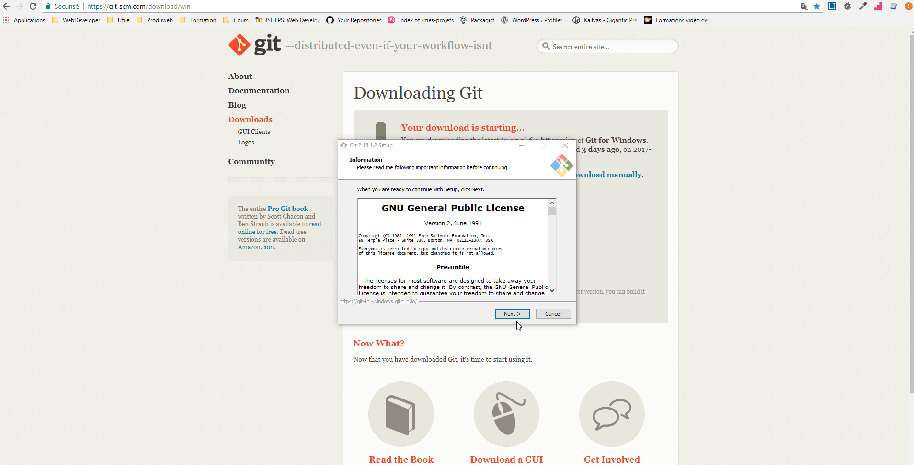

# Qu'est ce que Git ?

- C'est un logiciel de gestion de version
- Il est gratuit et personnalisable via son code source
- Il a été créé par [Linus Torvalds](https://fr.wikipedia.org/wiki/Linus_Torvalds) et [Andrew Morton](https://fr.wikipedia.org/wiki/Andrew_Morton), créateurs du noyau Linux
- Il fonctionne également hors ligne
- Il est décentralisé, ce qui veut dire que chaque personne possède son propre historique
- Il permet d'avoir plusieurs architectures, méthode de travail ([plus d'infos ici](https://git-scm.com/about/distributed))

**Site officiel** : [ici](https://git-scm.com/)

**Lien de téléchargement** : [ici](https://git-scm.com/downloads)

**Configuration** : [ici](https://git-scm.com/book/fr/v1/Personnalisation-de-Git-Configuration-de-Git)

## Installation Windows

