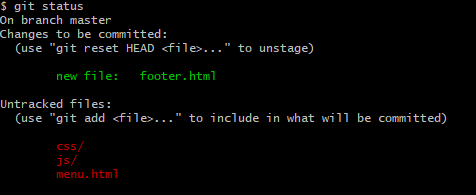
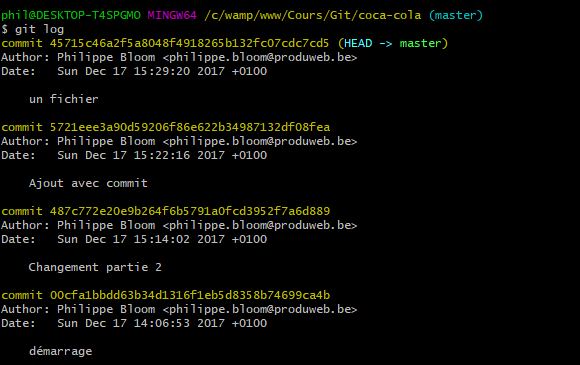

# Modifications du projet

## Ajouter un fichier

Lorsque vous créez un fichier HTML ou CSS ou autre...
Vous devez le signaler à Git afin qu'il ajout ce fichier à son index.

Pour ce faire, vous devez effectuer la commande ci-dessous :

````
git add nom_du_fichier
````

Afin de tester à tout moment si Git à bien ajouter votre fichier, vous pouvez effectuer la commande ``git status``

Exemple de résultat de la commande ``git status`` :



Vous constatez que les fichiers indiqués en verts sont ceux qui ont été ajoutés via ``git add``.

Les fichiers ou dossiers en rouges sont ceux qui n'ont pas encore été ajoutés.


## Créer un commit

Un commit est un ensemble de modifications qui correspondents à une fonctionnalité, à une résolution de bug, etc...

Donc si vous travaillez sur **deux fonctionnalités**, vous devez effectuer **deux commit** différents !

Un commit est obligatoirement accompagné d'un message. Ce message doit être le plus clair possible.

Pour effectuer un commit, il y a plusieurs manières :

- Avec la commande ``git commit``, celle-ci va enregistrer les fichiers de l'index vers le dépôt et ouvrir votre éditeur de texte afin d'écrire votre message lié au commit

- Avec la commande ``git commit -a``, grâce au ``-a``, cela va effectuer en plus un ``git add`` sur tous les fichiers modifiés (pas sur les fichiers créés)

- Avec la commande ``git commit nom_du_fichier``, celle-ci va effectuer en plus un ``git add nom_du_fichier``

- Avec la commande ``git commit --amend``, celle-ci va greffé les dernières modifications au dernier commit évitant ainsi de créer trop de commit


Afin d'afficher les derniers commit, vous pouvez utiliser la commande ``git log``




